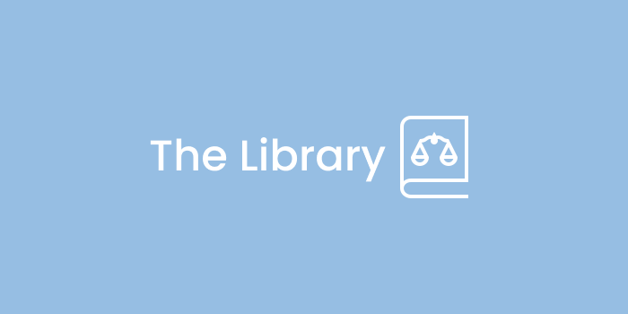
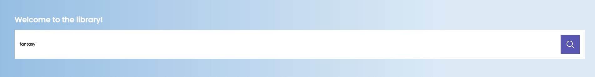
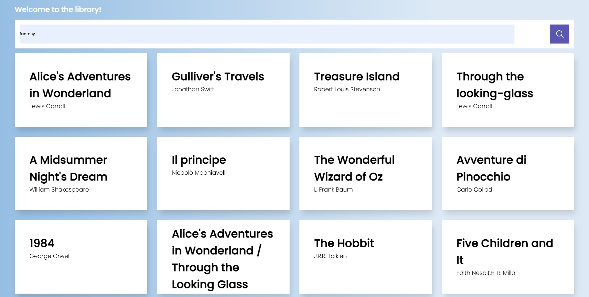
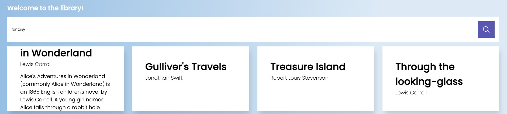

[![Stargazers][stars-shield]][stars-url]
[![Issues][issues-shield]][issues-url]
[![MIT License][license-shield]][license-url]
[![LinkedIn][linkedin-shield]][linkedin-url]


<!-- PROJECT LOGO -->
<br />
<div align="center" id="readme-top">
  <a href="https://github.com/Arm0ny/Books">
    
  </a>

<h3 align="center">Welcome To The Library</h3>

  <p align="center">
    simple and usefully website you can use to retrieve usefully information about some books
    <br/>
    <a href="https://github.com/Arm0ny/Books/issues">Report Bug</a>
    <a href="https://github.com/Arm0ny/Books/issues">Request Feature</a>
  </p>
</div>


<!-- TABLE OF CONTENTS -->
<details>
  <summary>Table of Contents</summary>
  <ol>
    <li>
      <a href="#about-the-project">About The Project</a>
      <ul>
        <li><a href="#built-with">Built With</a></li>
      </ul>
    </li>
    <li>
      <a href="#getting-started">Getting Started</a>
      <ul>
        <li><a href="#prerequisites">Prerequisites</a></li>
        <li><a href="#installation">Installation</a></li>
      </ul>
    </li>
    <li><a href="#usage">Usage</a></li>
    <li><a href="#roadmap">Roadmap</a></li>
    <li><a href="#contributing">Contributing</a></li>
    <li><a href="#license">License</a></li>
    <li><a href="#contact">Contact</a></li>
  </ol>
</details>


<section id="about-the-project">

<!-- ABOUT THE PROJECT -->
## About The Project

[![Product Name Screen Shot][product-screenshot]](https://example.com)

when you open the app you are prompted to a searchbar in witch you can type a particular subject to send to OpenLibrary's
api and query for books of that particular subject, then the app will show the results below as cards containing
the book's authors and title, you can also click on each one to get the description from the same api mentioned

<p align="right">(<a href="#readme-top">back to top</a>)</p>

</section>

<section id="built-with">

### Built With


* ![javascript][javascript_img]
* ![html_img][html_img]
* ![css_img][css_img]

<p align="right">(<a href="#readme-top">back to top</a>)</p>

</section>


<section id="getting-started">

<!-- GETTING STARTED -->
## Getting Started

This is an example of how you may give instructions on setting up your project locally.
To get a local copy up and running follow these simple example steps.

</section>

<section id="prerequisites">

### Prerequisites

this is a vanilla javascript project, so you won't need anything else then a browser to run it

</section>

<section id="installation">

### Installation
   ```sh
   git clone https://github.com/Arm0ny/Books.git
   ```
<p align="right">(<a href="#readme-top">back to top</a>)</p>

</section>

<section id="usage">

<!-- USAGE EXAMPLES -->
## Usage

when you click on the searchbar you must input a valid book's subject for the research
<br/>


<br/>
<br/>

then when you click enter or on the search button  the website will make a call to OpenLibrary's API at an endpoint like 
this: openlibrary.org/subjects/love.json and then display the matching books as follows:
<br/>


<br/>
<br/>
<br/>
then if you click on one of the showing results the site will query the description of the book you clicked to the API
and display it as follows:
<br/>

<br/>

_For more examples, please refer to the [Documentation](https://example.com)_

<p align="right">(<a href="#readme-top">back to top</a>)</p>

</section>

<section id="roadmap">

<!-- ROADMAP -->
## Roadmap

- adding search parameter display
- adding link to the OpenLibrary's page of the book


See the [open issues](https://github.com/Arm0ny/Books/issues) for a full list of proposed features (and known issues).

<p align="right">(<a href="#readme-top">back to top</a>)</p>

</section>

<section id="contributing">

<!-- CONTRIBUTING -->
## Contributing

Contributions are what make the open source community such an amazing place to learn, inspire, and create. Any contributions you make are **greatly appreciated**.

If you have a suggestion that would make this better, please fork the repo and create a pull request. You can also simply open an issue with the tag "enhancement".
Don't forget to give the project a star! Thanks again!

1. Fork the Project
2. Create your Feature Branch (`git checkout -b feature/AmazingFeature`)
3. Commit your Changes (`git commit -m 'Add some AmazingFeature'`)
4. Push to the Branch (`git push origin feature/AmazingFeature`)
5. Open a Pull Request

<p align="right">(<a href="#readme-top">back to top</a>)</p>

</section>

<section id="license">

<!-- LICENSE -->
## License

Distributed under the MIT License. See `LICENSE.txt` for more information.

<p align="right">(<a href="#readme-top">back to top</a>)</p>

</section>

<section id="contact">

<!-- CONTACT -->
## Contact

Your Name - armando.pagano2001@gmail.com

Project Link: [https://github.com/Arm0ny/Books](https://github.com/Arm0ny/Books)

<p align="right">(<a href="#readme-top">back to top</a>)</p>

</section>

<section id="credits">

<!-- Credits -->
## Credits

* thanks to <a href='https://openlibrary.org'>Open library</a> for offering their amazing API for this project 
* search icons used for the searchbar and the logo provided by <a href='https://icons8.it'>Icons8</a>

<p align="right">(<a href="#readme-top">back to top</a>)</p>

</section>

<!-- MARKDOWN LINKS & IMAGES -->
<!-- https://www.markdownguide.org/basic-syntax/#reference-style-links -->
[stars-shield]: https://img.shields.io/github/stars/Arm0ny/Books.svg?style=for-the-badge
[stars-url]: https://github.com/Arm0ny/Books/stargazers
[issues-shield]: https://img.shields.io/github/issues/Arm0ny/Books.svg?style=for-the-badge
[issues-url]: https://github.com/github_username/repo_name/issues
[license-shield]: https://img.shields.io/github/license/Arm0ny/Books.svg?style=for-the-badge
[license-url]: https://github.com/Arm0ny/Books/blob/master/LICENSE.txt
[linkedin-shield]: https://img.shields.io/badge/-LinkedIn-black.svg?style=for-the-badge&logo=linkedin&colorB=555
[linkedin-url]: https://www.linkedin.com/in/armando-pagano-67787916a
[product-screenshot]: img/screenshots/Library_screenshot.png
[Next.js]: https://img.shields.io/badge/next.js-000000?style=for-the-badge&logo=nextdotjs&logoColor=white
[Next-url]: https://nextjs.org/
[React.js]: https://img.shields.io/badge/React-20232A?style=for-the-badge&logo=react&logoColor=61DAFB
[React-url]: https://reactjs.org/
[Vue.js]: https://img.shields.io/badge/Vue.js-35495E?style=for-the-badge&logo=vuedotjs&logoColor=4FC08D
[Vue-url]: https://vuejs.org/
[Angular.io]: https://img.shields.io/badge/Angular-DD0031?style=for-the-badge&logo=angular&logoColor=white
[Angular-url]: https://angular.io/
[Svelte.dev]: https://img.shields.io/badge/Svelte-4A4A55?style=for-the-badge&logo=svelte&logoColor=FF3E00
[Svelte-url]: https://svelte.dev/
[Laravel.com]: https://img.shields.io/badge/Laravel-FF2D20?style=for-the-badge&logo=laravel&logoColor=white
[Laravel-url]: https://laravel.com
[Bootstrap.com]: https://img.shields.io/badge/Bootstrap-563D7C?style=for-the-badge&logo=bootstrap&logoColor=white
[Bootstrap-url]: https://getbootstrap.com
[JQuery.com]: https://img.shields.io/badge/jQuery-0769AD?style=for-the-badge&logo=jquery&logoColor=white
[JQuery-url]: https://jquery.com 
[javascript_img]: https://img.shields.io/badge/-javascript-black?style=for-the-badge&logo=javascript
[html_img]: https://img.shields.io/badge/-HTML5-DD0031?style=for-the-badge&logo=html5
[css_img]: https://img.shields.io/badge/-CSS3-0769AD?style=for-the-badge&logo=css3

